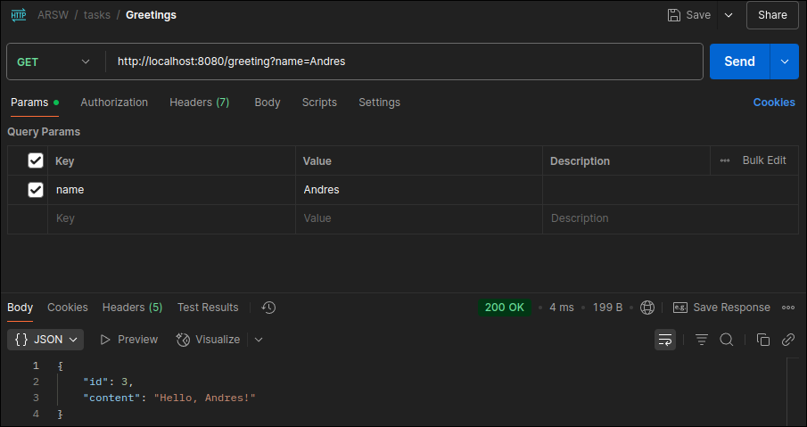
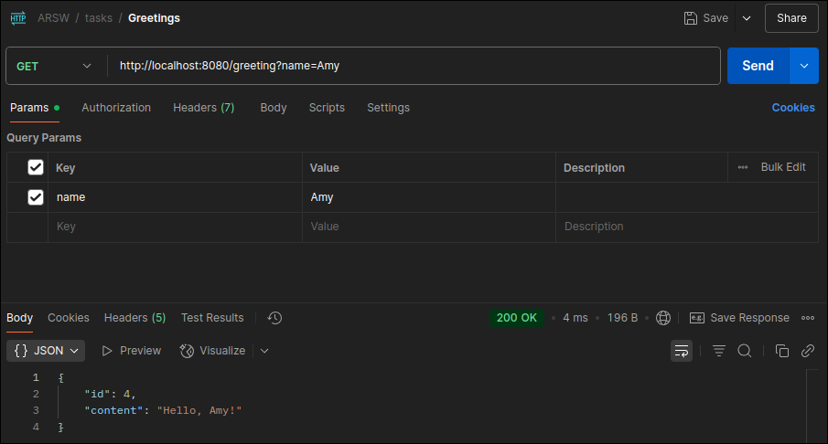

<div align="center">
    <h1 align="center">RestFul APIs</h1>
    <p align="center">
A simple project to demonstrate the implementation and testing of a RESTful controller.
    </p>
</div>

</br>


## Description

This repository contains the source code for a RESTful API developed for academic and demonstration purposes. The main goal is to show how to build web services that follow the principles of REST architecture and how to test them effectively with tools like Postman.

</br>
</br>

## Getting Started 🚀

These instructions will get you a copy of the project up and running on your local machine for development and testing purposes.

</br>

## Installation 🔧

Clone the repository to your local machine.

```sh
git clone https://github.com/Andr3xDev/ARSW-RestFul.git
```

Install the project dependencies (if you are using Maven).

```sh
cd ARSW-RestFul
mvn verify
```

Run the project.
```sh
mvn spring-boot:run
```

</br>
</br>

## Testing the Endpoints with Postman 🧪

Here is an example of how to test the main endpoint:

    Method: GET
    URL: http://localhost:8080/greeting
    param:
        name: <String>

Expected Response (Code 200 OK)

```json
{
    "message": "Hello, World!"
}
```





